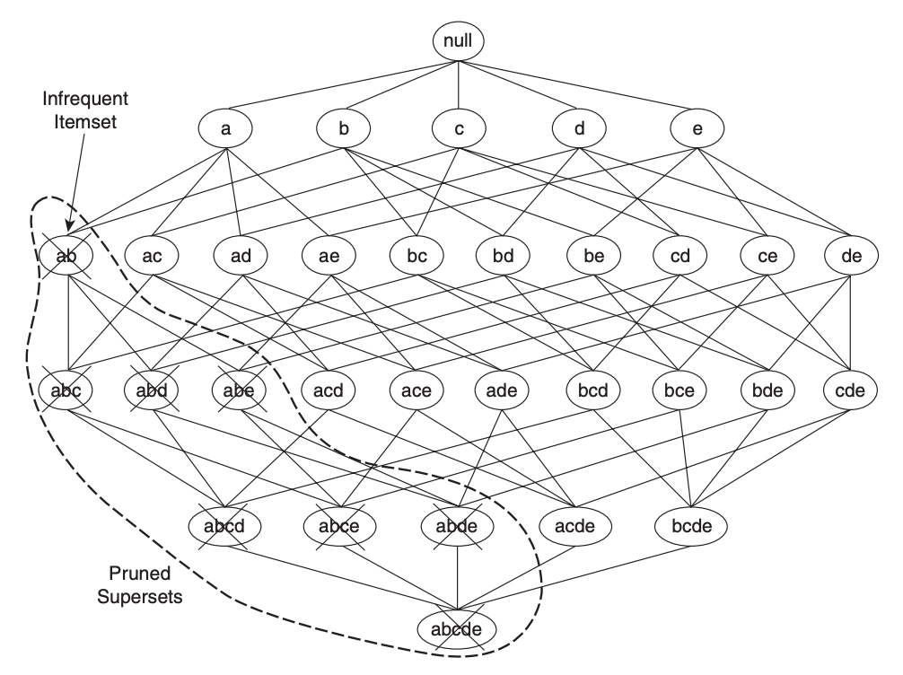

```{r setup, include=FALSE}
knitr::opts_chunk$set(echo = TRUE, warning = FALSE)
```

```{r packages, include=FALSE}
library(kableExtra)
library(tidyverse)
library(arules)
library(arulesViz)
```

## Introduction (Sean)

Association rule analysis has become an increasingly popular analytical method, because of how useful it can be for commercial databases. Association anlysis can be used any times you have items sets and a variety of items that may or may not be included in a given set. The goal for this analysis is to uncover relationships between these items. The most practical application for this type of analysis is for retailers who would like to find metrics related to the items that are frequently bought together. The value proposition for this type of analysis is massive, as it can help optimize things like reccomendation algorithms, special deals, inventory management and other aspects which are vital to retailers.  

In the context of this "market basket" analysis, the goal is gernally to seek joint values of items $I = {i_1, i_2 \dots i_d}$ which consistently arise in your database's transactions $T = {t_1, t_2, \dots, t_N}$. While it might be more simple and asthetically pleasing to think of each transaction as a set like: 

$t_1 = {i_1, i_3, i_4}, t_2 = {i_1,i_2,i_5}$

it may be more pratical to have your data represented in a binary representation:

|    | $i_1$ | $i_2$ | $i_3$ | $i_4$ | $i_5$ |
|----|----|----|----|----|----|
| $t_1$ | 1  | 0  | 1  | 1  | 0  |
| $t_2$ | 1  | 1  | 0  | 0  | 1  |

where each cell has a 1 if the transaction has a given item and a 0 ortherwise. 

Put simply, the goal of this analysis is to find conditions where the probability density of finding a given item in a set $Pr(x_i)$ is larger than it is outside of said conditions. 

In this tutorial we will go over the specifics of how this is accomplished. We will start by introducing a dataset for which these methods can be implemented. Next, we will go more into detail regarding possible applications of this type of analysis. This includes the implementation and uses of the apriori algorithm, a vital algorthim for association rule analysis. Finally we will examine some of the most important interest measures for association rules, including support, confidence, leverage, and lift. 

## Applications (Andre)

One of the most common applications of association analysis comes in business, where companies are trying to determine how groups of items are sold together. This is often referred to as "market analysis" or "market basket analysis". Besides market basket data, association analysis is also applicable to other application domains such as bioinformatics, medical diagnosis, Web mining, and scientific data analysis. In truth, association analysis can be useful whenever one is interested in uncovering interesting or significant relationships within large datasets. For the purposes of this tutorial, we will be walking through a market basket analysis on a sample dataset of grocery purchases.

## Data
The data we use for this tutorial can be found on Kaggle [here](https://www.kaggle.com/heeraldedhia/groceries-dataset). There are 38765 rows of purchase orders from grocery stores, but we need to perform some cleaning before we can really make effective use of these data. We use the unite() function to combine the Member_number and Date columns into a new column, called transactions, which we will use to identify the transactions, and then rename the other column to just be called items. This allows us to use the language of association analysis (transactions and items) more clearly as we proceed. Lastly, we only keep unique rows of the data, so that no transactions will have duplicate items. In effect, this allows us to only concern ourselves with the presence or absense of an item in a transaction, rather than how many times an item appears. We do this because working with vectors over a field of two elements is much easier than vectors over the integers.

```{r, message=FALSE}
#https://www.kaggle.com/heeraldedhia/groceries-dataset
#reading in the data
groceries <- read_csv("groceries_dataset.csv")
#cleaning the data
groceries <- groceries %>% unite(transactions, Member_number, Date, sep = '_')
groceries <- groceries %>% rename(items = itemDescription)
#transactions: customer identification + _ + date of transaction
#items: item in transaction
#checking the data so no transactions have duplicate items
groceries <- groceries %>% distinct(transactions, items, .keep_all = TRUE)
```

Next, we will need the number of transactions and the number of items for future reference, as well as for some simple visualization, so we calculate them here.

```{r}
num_trans = n_distinct(groceries$transactions) #number of transactions: 14,963
num_items = n_distinct(groceries$items) # number of items: 167
```

To try to visualize how our dataset looks, we plot a simple bar graph. We see that most of our transactions have 9 items in them.
```{r}
count(groceries, transactions) %>% 
  ggplot(aes(n)) + geom_bar() + xlab("number of items per transaction") + ggtitle('Distribution of items per transaction') + theme(plot.title = element_text(hjust = 0.5))
```

For a more complete understanding of the dataset, we examine the summary statistics. This tells us that we have 14,963 transactions with 167 items among them, our more frequent items, the distribution of lengths of transactions, and more.

```{r}
trans_list = split(groceries$items, groceries$transactions) # get transaction list
trans_class = as(trans_list, "transactions") #get transaction class
summary(trans_class)
```

Another way to visualize this data at a high level is the following... 
```{r}
#binary incident matrix
head(trans_class@data, n=20)
dim(trans_class@data) #rows = 167 = items, #cols = 14963 = transactions
```

Before we continue much further, it can be useful to understand what our most frequent items are. 

```{r}
#finding counts and support for most frequent items
freq_items = count(groceries, items, sort=TRUE) %>% mutate(support=n/num_trans)
```

Now we visually examine the 20 most frequent items. This allows us to build an intuition of what items are going to be the most significant actors in our exploration of these data.  

```{r}
#plotting top 20 most frequent items
freq_items %>% slice(1:20) %>% 
  ggplot(aes(fct_reorder(items, n), n)) + # order bars by n
  geom_col() +         # barplot
  coord_flip() +       # rotate plot 90 deg
  theme(axis.title.y = element_blank()) # remove y axis title
```

## Apriori Algorithm (Hannah)
=======
## Apriori Algorithm
>>>>>>> a31e77354247703374db586828080f1c8b5740c9

### Description

In association analysis, one might want to find all itemsets in the dataset with support that meets some support threshold $s$. But if there are $x$ items in the dataset, then there are $2^x - 1$ possible non-empty itemsets, which could cause computing time and space issues with too large of a search space. The Apriori algorithm seeks to decrease the time to find all such itemsets by restricting the search space of the dataset. To do this, it uses the rule that if an itemset is frequent, then all of its subsets must also be frequent; which also means that if an itemset is not frequent, then none of its supersets will be frequent. This makes sense since one rule of probability is that $P(A, B) \leq P(A)$; which in terms of our goal means that $S(\{a, b\}) \leq S(\{a\})$, so if $S(\{a\}) < s$, then $S(\{a, b\}) \leq s$. The Apriori algorithm uses this rule to search over the dataset and find all itemsets with at least a support of $s$ as follows.

The first pass over the data computes the support of all itemsets of size one, and if the support of an itemset is less than $s$, then the item in that itemset is discarded from the data. The next pass computes the support of all itemsets of size two with items that withstood the first pass. Now, if the support of an itemset is less than $s$, then both of the items in that itemset are discarded from the data. For each pass, this method saves all itemsets of that size that meet the support threshold, and throws out the itemsets that did not. This process continues until there are no more itemsets with a support of at least $s$, and then returns all itemsets that were saved in each pass. Since this method restricts the search space for each pass, it decreases the search time as well; which means that this process will run in reasonable time even with enormous datasets.

```{r, echo=FALSE, out.width="60%", fig.align='center'}

```

The graph above shows a visual representation of the support-based pruning in the Apriori algorithm. This process is akin to alpha-beta pruning, which is a search method that decreases the number of nodes evaluated by the minimax algorithm in its search tree. In this same way, the Apriori algorithm reduces the number of itemsets evaluated by this algorithm in its search space. In this example, the algorithm finds that the itemset $\{a, b\}$ does not meet the support threshold $s$, or $S(\{a, b\}) \leq s$. This means that all supersets of $\{a, b\}$, or itemsets of greater size that contain $a$ and $b$, will also not meet the support threshold $s$ since the $S(\{x, y\}) \leq S(\{x\})$ for any items $x, y$. The Apriori algorithm then discards all supersets of $\{a, b\}$ from the search space, such as $\{a, b, c\}, \{a, b, c, d\},$ and $\{a, b, c, d, e\}$. This pruning process saves significant computing time and space for even large datasets as long as the data is sparse enough and the threshold is high enough. 

Each itemset $K$ that meets some support threshold can be cast into a set of association rules that show relationships between two itemsets in the form of $A \rightarrow B$. The first itemset $A$ is called the "antecedent", and the second itemset $B$ is called the "consequent"; and no one item can be shared in both $A$ and $B$. The "support" of the rule $S(A \rightarrow B)$ is the fraction of observations in the union of the antecedent and the consequent, which is just the support of the itemset $K$ from which $A$ and $B$ were split. Support approximates $P(A, B)$, or the probability of observing in the population itemsets $A$ and $B$ simultaneously in a basket. The "confidence" of the rule $C(A \rightarrow B)$ is the support of the union of these two itemsets over the support of the antecedent, or $C(A \rightarrow B) = \frac{S(A \rightarrow B)}{S(A)}$. Confidence approximates $P(B \vert A)$, or the probability of observating in the population itemset $A$ in a basket with prior information that itemset $B$ is in that basket.

In this way, the Apriori algorithm can find all rules that meet some confidence threshold $c$ containing all itemsets that meet some support threshold $s$. Thus, the output of this method is a collection of association rules that meet the constraints that $S(A \rightarrow B) > s$ and $C(A \rightarrow B) > c$. In terms of market basket research, this means that it finds all relationships between items in $A$ and $B$ in which the probability of observing all items in the union of $A$ and $B$ in a basket is greater than $s$, and the probability of observing itemset $A$ in a basket with prior information of itemset $B$ in that basket is greater than $c$. It should be noted that these relationships represent association and not causation between antecendents and consequents, which means that when $C(A \rightarrow B)$ is high, we should not assume that if a customer buys itemset $A$, then this selection influences the customer to also buy itemset $B$. We should also be careful about assumptions if expected transactions in the future come from a different distribution than the observed transactions in the dataset. We should not extrapolate the conclusions of this association analysis outside the population of the dataset we use.

### Implementation

You can run this algorithm in R with the "apriori" function in the "arules" package, and you can find the documentation for this function [here](https://www.rdocumentation.org/packages/arules/versions/1.6-6/topics/apriori). The arguments for this function are as follows:

* "data" is an object of the "transactions" class that holds the items and transactions or a data structure that can be coerced to the "transactions" class (you can find more information on this class [here](https://www.rdocumentation.org/packages/arules/versions/1.6-6/topics/transactions-class))
* "parameter" is an object of the "APparameter" class or a list that sets the minimum support ("support"), the minimum confidence ("confidence"), the minimum and maximum itemset sizes in total ("minlen" and maxlen"), the type of association mined ("target"), and other variables that you can find [here](https://www.rdocumentation.org/packages/arules/versions/1.6-6/topics/ASparameter-classes)
* "appearance" is an object of the "APappearance" class or a list that sets the restrictions on the associations mined, such as what items are in the antecendent ("lhs"), what items are in the consequent ("rhs"), what items can be in the itemset ("item"), what items cannot be in the itemset ("none"), and other variables that you can find [here](https://www.rdocumentation.org/packages/arules/versions/1.6-6/topics/APappearance-class)
* "control" is an object of the "APcontrol" class or a list that sets the algorithmic parameters of the mining algorithm, such as how to sort items ("sort"), if it should report progress ("verbose"), how to filter unused items ("filter"), and other variables that you can find [here](https://www.rdocumentation.org/packages/arules/versions/1.6-6/topics/AScontrol-classes)

The function returns an object of the "rules" class (you can find more information on that [here](https://www.rdocumentation.org/packages/arules/versions/1.6-6/topics/rules-class)) or the "itemsets" class (you can find more information on that [here](https://www.rdocumentation.org/packages/arules/versions/1.6-6/topics/itemsets-class)) depending on what you set for the "target" parameter. The default values for the "support", "confidence", "minlen", and "maxlen" parameters are all 0.1, 0.8, 1, and 10 respectively. It should also be noted that this function only returns rules with one item in the consequent; so if "minlen" is set to 1, then no items are in the antecendent, so ${} \rightarrow B$. This means that the confidence will be the probability of observing itemset $B$ in a basket regardless of what items are already in the basket, which is just equivalent to the support of $B$. You can forgo these sorts of rules by setting "minlen" to 2.

```{r}
#function for printing output from apriori() function
#source: Michael Porter
apriori_output <- function(x){
  if(class(x) == "itemsets"){
    out = data.frame(items=arules::labels(x), x@quality, stringsAsFactors = FALSE)
  }
  else if(class(x) == "rules"){
    out = data.frame(
      lhs = arules::labels(lhs(x)),
      rhs = arules::labels(rhs(x)),
      x@quality, 
      stringsAsFactors = FALSE)
  }
  else stop("only works with class of itemsets or rules")
  if(require(tibble)) as_tibble(out) else out
}
```

For our groceries dataset, let's say we want to find all frequent itemsets with a support of at least 0.1, with at least 1 item, and with at most 2 items. We can use the "apriori" function and first pass it our dataset cast to a "transactions" class. We can then pass it a list of parameters that set the "support" to 0.01, the "minlen" to 1, the "maxlen" to 2, and the target to "frequent" since we are interested in finding frequent itemsets. We can then use our "apriori_output" function to print out the results of this method, including the items, their support, and their count. We can also sort the items depending on their support in descending order, and then we are left with the following table. From this table, we can see that whole milk has the greatest support (0.158) out of all itemsets in this dataset that have at least one and at most two items. This means that the whole milk occurs in 2,363 observations out of 14,963 transactions, so $\hat{P}(\text{{whole milk}})$, or the approximate probabilty in the population of whole milk being in a basket is 2363/14963 = 0.158.

```{r, message=FALSE, results='hide'}
#finding all frequent itemsets >= support threshold
s = 0.01
min = 1
max = 2
freq_items1 = apriori(trans_class, #run apriori function to find frequent items
               parameter = list(support = s, minlen = min, maxlen = max, target="frequent"))
```
```{r}
apriori_output(freq_items1) %>% 
  arrange(-support) #order by support (largest to smallest)
```

But we may also want to find all association rules with a support of at least 0.01, with a confidence of at least 0.10, and with at least 2 items in each rule. Then the "apriori" function will take all of the size-two itemsets from our last run that had a support of at least 0.01 and permutate all items in these itemsets to find all rules with a confidence of at least 0.10. We can again use the "apriori" function and first pass it our dataset cast to a "transactions" class. We can then pass it a list of parameters that set the "support" to 0.01, "confidence" to 0.10, the "minlen" to 2, and the target to "rules" since we are interested in finding association rules. We can then print out the results of this function with our "aprior_output" function, including the itemset of the antecedent ("lhs"), the itemset of the consequent ("rhs"), and the support, the confidence, and the count of each rule. We can also sort the rules depending on their confidence in descending order, and then we are left with the following table.

```{r, message=FALSE, results='hide'}
#finding all association rules >= support threshold and >= confidence threshold
s = 0.01
c = 0.10
min = 2
freq_rules1 <- apriori(trans_class, 
               parameter = list(support = s, confidence = c, minlen = min, 
               target="rules"))
```
```{r}
apriori_output(freq_rules1) %>% arrange(-confidence) #order by confidence (largest to smallest)
```

From this table, we can see that the rule {yogurt} $\rightarrow$ {whole milk} has the greatest confidence (0.130) out of all rules derived from this dataset that have at least two items. This means that $\hat{P}(\text{{whole milk}}\vert \text{{yogurt}})$, or the approximate probability in the population of whole milk being in a basket given that yogurt is in that basket is 0.130. Market owners could use this information to increase their sales of whole milk by placing whole milk next to yogurt since it seems that customers who buy yogurt are also likely to buy whole milk. But we could have also calculated the confidence of this rule by first finding all itemsets with a support of at least 0.01 that contain whole milk or yogurt or both. We know that $C(\text{{yogurt}} \rightarrow \text{{whole milk}}) = \frac{S(\text{{yogurt}} \rightarrow \text{{whole milk}})}{S(\text{yogurt})} = \frac{S(\text{{yogurt, whole milk}})}{S(\text{yogurt})}$, so the confidence of {yogurt} $\rightarrow$ {whole milk} is 0.0112/0.0859 = 0.130. 

```{r, message=FALSE, results='hide'}
itemset = c("whole milk", "yogurt")
s = 0.01
milk_and_yogurt = apriori(trans_class, 
        parameter = list(support = s, target="frequent"), 
        appearance = list(items = itemset))
```
```{r}
apriori_output(milk_and_yogurt)
```

While this can be helpful most of the time, not all rules with high support and confidence are useful. If the support of {whole milk} is very high and the support of {yogurt} is very high, then the confidence of {yogurt} $\rightarrow$ {whole milk} will be high regardless of if there are real association between these itemsets. 


## Other Interest Measures (Annie)

The concept of interestingness is subjective in nature, and depends on the goals of a business or a research question. The interestingness of a rule oftentimes determines its value, depending on the given context. There are multiple different ways to measure the interestingness of a rule, many of which are included in the arules package. 

The author of the arules package, Michael Hashler, separates support and confidence from the rest of the interest measures based on their importance. We chose only five alternative interest measures for the sake of this tutorial, but more can be found on [Hahsler’s page](https://michael.hahsler.net/research/association_rules/measures.html). 

### Support and Confidence Review

#### Support

* **Support** is a proportion of transactions that contain item X. It can also be thought of as the probability of X getting into a future transaction. Low support could indicate that a rule happens by chance.

  * $support(A)$ = (# of transactions containing $A$) / (# total transactions)
  
  * $support(A) = P(A \cap B)$
  
  * If an itemset has support greater than or equal to some user defined minimum support threshold, then we can call it a **frequent itemset** or a **large itemset**.  
  
  * Hashler points out a potential drawback of support called the **rare item problem**. It is possible for items that occur very infrequently to still produce useful results. However, when transaction data has an uneven distribution of support for individual items, these “rare items” are sometimes pruned out and overlooked
  
#### Confidence

* **Confidence** is an estimate of conditional probability of Y being in a basket given the basket already contains X. 

  * $conf(A \rightarrow B) = P(B | A)$
  
  * It’s important to watch out for how support impacts confidence. Due to the way confidence is calculated, subsequent items with higher support will automatically produce higher confidence values even if there exists no association between the items.
  
  * A rule is a *high confidence rule* if it has confidence greater than or equal to a *confidence threshold* that the user selects. 

### Alternative interest measures

#### Lift

* **Lift** is based on statistical independence, and is not directional. Hahsler says "lift measures how many times more often X and Y occur together than expected if they were statistically independent." In other words, lift defines an interesting rule as one that happens more or less than we would normally expect. 

  * $lift(A \rightarrow B) = lift(B \rightarrow A) = \frac{conf(A \rightarrow B)}{supp(B)} = \frac{conf(B \rightarrow A)}{supp(A)} = \frac{P(A \cap B)}{P(A)P(B)}$
  * Lift = 1 indicates independence between A and B
  * Lift > 1 indicates positive association between A and B. 
    * This means these two items are likely to occur together.
  * Lift < 1 indicates negative association between A and B 
    * This means these two items aren’t likely to occur together.
    
#### Cosine 
    
* **Cosine** is a measure of correlation between the items in X and Y defined as [(Tan et al. (2004))](https://michael.hahsler.net/research/bib/association_rules/#arules:Tan:2004)

  * $cosine(A \rightarrow B) = \frac{P(A) \cap P(B)}{\sqrt{P(A)P(B)}} = \sqrt{P(A|B)P(B|A)}$
  * Value between [0, 1]
  * 0.5 means no correlation 
  * Null-invariant: does not change with the number of null transactions 
  
#### Jaccard coefficient
  
* **Jaccard's coefficient** is a measure for dependence using the Jaccard similarity between the two sets of transactions that contain the items in A and B, respectively (Hahsler). Defined as

  * $jaccard(A \rightarrow B) = \frac{P(A \cap B)}{P(A) + P(B) - P(A \cap B)}$
  * Null-invariant: does not change with the number of null transactions 

  
#### Rule Power Factor

* **Rule Power Factor** weights the confidence of a rule by its support. (Hasler) Defined as

  * $rpf(A \rightarrow B) = supp(A \cup B) * conf(A \cup B)$

## References


```{r}
#function for printing output from apriori() function
#source: Michael Porter
apriori_output <- function(x){
  if(class(x) == "itemsets"){
    out = data.frame(items=arules::labels(x), x@quality, stringsAsFactors = FALSE)
  }
  else if(class(x) == "rules"){
    out = data.frame(
      lhs = arules::labels(lhs(x)),
      rhs = arules::labels(rhs(x)),
      x@quality, 
      stringsAsFactors = FALSE)
  }
  else stop("only works with class of itemsets or rules")
  if(require(tibble)) as_tibble(out) else out
}
```

```{r}
#finding all frequent itemsets >= support threshold
s = 0.01
min = 1
max = 2
freq_items1 = apriori(trans_class, #run apriori function to find frequent items
               parameter = list(support = s, minlen = min, maxlen = max, target="frequent"))
apriori_output(freq_items1) %>% 
  arrange(-support) #order by support (largest to smallest)
```

```{r}
#adding lift as an interest measure
apriori_output(freq_items1) %>% 
  mutate(lift = interestMeasure(freq_items1, measure="lift", trans_class)) %>% 
  arrange(lift) #order by lift (smallest to largest)
```

```{r}
#finding all association rules >= support threshold and >= confidence threshold
s = 0.01
c = 0.10
min = 2
freq_rules1 <- apriori(trans_class, 
               parameter = list(support = s, confidence = c, minlen = min, 
               target="rules"))

apriori_output(freq_rules1) %>% arrange(-confidence) #order by confidence (largest to smallest)
```

```{r}
apriori_output(freq_rules1) %>% arrange(-confidence) #order by confidence (largest to smallest)
```

```{r}
apriori_output(freq_rules1) %>% arrange(-lift) #order by lift (largest to smallest)
```

```{r}
itemset = c("whole milk", "yogurt")
s = 0.01
milk_and_yogurt = apriori(trans_class, 
        parameter = list(support = s, target="frequent"), 
        appearance = list(items = itemset))

apriori_output(milk_and_yogurt)
```

```{r}
#adding other interest measures
apriori_output(freq_rules1) %>% 
  mutate(AV = interestMeasure(freq_rules1, measure="addedValue", trans_class), 
         PS = interestMeasure(freq_rules1, measure="leverage", trans_class)) %>% 
  arrange(-AV)
```

```{r}
plot(freq_rules1, method="graph", measure="lift")
```